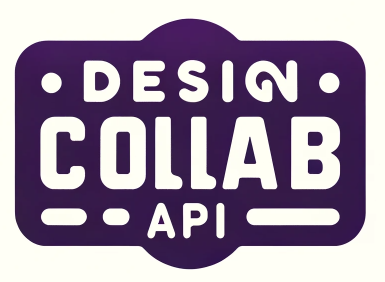

# DesignCollab

[](https://github.com/a-platform-for-designers/a-platform-for-designers-backend/actions/workflows/main.yml)

## Описание проекта:

**DesignCollab** - это веб-платформа для дизайнеров, позволяющая сотрудничать, обмениваться идеями и создавать проекты. Платформа предлагает удобный интерфейс и инструменты для эффективной работы.

- **Сайт**: [Посетите здесь](https://designcollab.pro/)
- **Swagger**: [Интерфейс Swagger](https://designcollab.pro/api/schema/swagger-ui/)
- **Redoc**: [Интерфейс Redoc](https://designcollab.pro/api/schema/redoc/)

## Технологии:
Django - это мощный фреймворк для создания веб-приложений на Python. Он предоставляет широкий спектр инструментов, включая маршрутизацию, шаблонизацию, аутентификацию и многое другое, что значительно упрощает процесс разработки веб-приложений.

Django REST framework - это набор инструментов для создания REST API на Python. Он включает функционал для обработки различных форматов данных, аутентификации и многих других возможностей, что делает процесс создания REST API более эффективным и удобным.

Djoser - это фреймворк для создания REST API, который специализируется на регистрации, аутентификации и управлении пользователями. Он предлагает функционал для работы с электронной почтой и множество других возможностей, что делает управление пользователями удобным и надежным.

DRF Spectacular - это расширение для Django REST framework, предназначенное для создания схемы OpenAPI для REST API. Оно автоматически генерирует схему OpenAPI, что значительно облегчает процесс разработки и тестирования API. С помощью DRF Spectacular, вы можете легко создавать документацию для вашего API, а также использовать сгенерированную схему для автоматического тестирования.

Daphne — это интерфейсный сервер HTTP, HTTP2 и WebSocket для ASGI и Channels, который поддерживает Django. Он способен обрабатывать несколько протоколов одновременно, например, одновременно обслуживать HTTP и WebSocket запросы. Daphne действует как точка входа для ASGI-приложений, принимая входящие сетевые запросы и перенаправляя их на ваше приложение.

Docker - это платформа для упаковки и развертывания приложений в контейнерах. Он позволяет разработчикам упаковывать приложения вместе с их зависимостями в контейнеры, которые могут быть запущены на любой платформе, где установлен Docker. Это значительно упрощает управление и развертывание приложений в различных средах.

Channels — это проект, который расширяет возможности Django для обработки асинхронных протоколов, таких как WebSockets, MQTT, чат-боты и многое другое. Он расширяет способности Django за пределы HTTP, позволяя обрабатывать WebSockets, протоколы чатов, протоколы IoT и многое другое. Он построен на спецификации Python под названием ASGI.

wait-for-it.sh - это скрипт на языке Bash, который ожидает готовности сервера перед тем, как продолжить выполнение других команд. В контексте Docker, он может быть полезен для убеждениясь, что серверы внутри контейнеров готовы к работе перед запуском приложения. Это помогает избежать возможных ошибок из-за неготовности окружения перед началом работы приложения.

## Запуск проекта через Docker(localhost):

Для запуска проекта необходимо выполнить следующие шаги:

 - [ ] Клонировать репозиторий:
```
git clone https://github.com/a-platform-for-designers/a-platform-for-designers-backend.git
```

 - [ ] Переименовать файл example.env в .env и заполнить его своими
       данными:
```
DB_ENGINE=django.db.backends.postgresql
DB_NAME=poostgres
DB_USER=postgres
DB_PASSWORD=postgres
DB_HOST=localhost/db
DB_PORT=5432
SECRET_KEY='secretgenerate'
DEBUG = True
REDIS_HOST=redis
REDIS_PORT=6379
```

> Генератор секретного ключа: infra/secretgenerate.py
>
> Код, который преобразует изображение в строку в формате base64: infra/converter.py

 - [ ] Запустить Docker из папки infra:
```
 docker-compose up -d
```

 - [ ] Зарегистрировать суперпользователя:
```
docker-compose exec backend python manage.py createsuperuser
```

 - [ ] Запустить проект:

 
http://localhost/

 - [ ] После запуска проекта будут доступны следующие ссылки(API):

> Swagger UI:

http://localhost/api/schema/swagger-ui/

> ReDoc от DRF Spectacular:

http://localhost/api/schema/redoc/

> Скачать схему проекта можно по ссылке:

http://localhost/api/schema/


### **Дополнительная информация:**

 - При сборке контейнеров файлы entrypoint.sh, entrypoint_daphne.sh и wait-for-it.sh должны быть в формате Unix, а не в формате DOS.
 Если после сборки контейнер не видит их, вы можете использовать утилиту dos2unix для конвертации файлов в формат Unix. Если у вас установлен Git Bash или WSL на Windows, вы можете выполнить следующую команду:
  - [ ] Git Bash из папки backend:
```
 dos2unix entrypoint.sh entrypoint_daphne.sh wait-for-it.sh
```
 - Ответ должен быть:

``` 
MINGW64 ~/a-platform-for-designers-backend/backend (main)   
dos2unix entrypoint.sh entrypoint_daphne.sh wait-for-it.sh
dos2unix: converting file entrypoint.sh to Unix format...
dos2unix: converting file entrypoint_daphne.sh to Unix format...
dos2unix: converting file wait-for-it.sh to Unix format...

```
 - При сборке контейнеров в файле entrypoint.sh прописаны команды, которые можно отредактировать:

команды в entrypoint.sh:

> Выполняем миграции и загружаем данные:
> 
> python manage.py makemigrations
> 
> python manage.py migrate
> 
> python manage.py load_data
> 
> python manage.py collectstatic --no-input
 

 - Список полезных команд:


```
docker-compose up -d
docker-compose exec backend python manage.py makemigrations
docker-compose exec backend python manage.py migrate
docker-compose exec backend python manage.py createsuperuser
docker-compose exec backend python manage.py collectstatic --noinput
```

 - requirements.txt:
 
    channels==4.0.0
    channels-redis==4.1.0
    daphne==4.0.0
    django-cors-headers
    Django==4.2.1
    django-filter==22.1
    djangorestframework==3.14.0
    djoser==2.1.0
    drf-api-logger
    drf-extra-fields==3.5.0
    drf-spectacular
    flake8==6.0.0
    gunicorn==20.1.0
    importlib-metadata
    isort
    Markdown==3.4.1
    Pillow
    psycopg2-binary==2.9.3
    python-dotenv==0.21.0
    zipp==3.15.0
    ////
